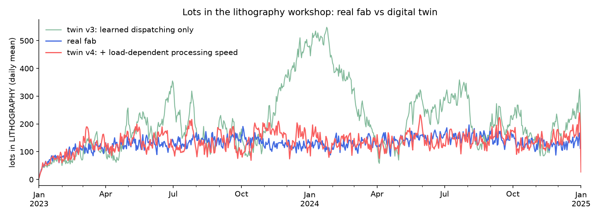
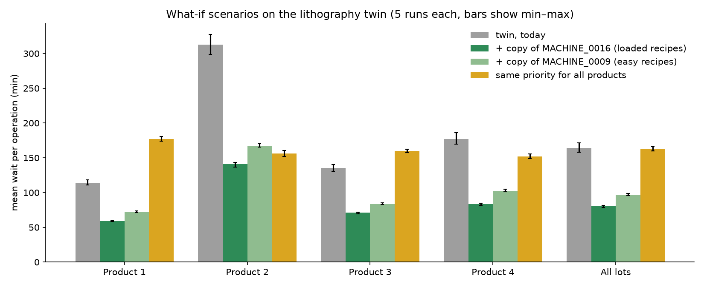

# Wafer Fab Digital Twin — Lithography Workshop

Data-driven digital twin of the lithography workshop of a semiconductor wafer fab, built in Python with SimPy and calibrated on two years of production logs.

The twin reproduces the real waiting time within **6%**, and is then used to answer what-if questions: adding one machine at the right place **halves** waiting, while changing product priority only **redistributes** it.

## At a glance

- **Data**: simulated production logs of a wafer fab, 2 years (Jan 2023 – Dec 2024), 4 products, 130 machines in 3 workshops, 1.76 M operations
- **Bottleneck**: lithography, with 99.2% machine utilization and 65% of all waiting in the fab
- **Model**: a discrete-event simulation of the 40 lithography machines, whose behaviour is learned from the data (processing times, dispatching rule, load effect)
- **Validation**: mean waiting 164 min in the twin vs 156 min in reality, every recipe within 0.97–1.21× of reality, stable across runs (±4%)
- **Stack**: Python, pandas, NumPy, SciPy, SimPy, Matplotlib

## Key result: the twin behaves like the real workshop



*Number of lots in the lithography workshop (waiting or being processed), daily mean over two years. The blue curve is the real fab. In green, an intermediate version of the twin: it reproduces how machines pick lots, but its queue drifts into huge waves (up to ~550 lots). In red, the final twin: adding the fact that real machines work slightly faster when the workshop is crowded gives it the same self-regulation as the real fab, and its curve stays in the real range for two years. The drop on the very last day is an end-of-data effect: no new lots arrive, and the workshop empties.*

## How the twin works

Lots enter the lithography queue at their **real** times, taken from the logs. Everything that happens inside the workshop is simulated:

1. **Which machine can take a lot.** Each of the 40 machines can only run some recipes (compatibility table).
2. **Which lot a free machine picks.** A weighted random choice, learned from ~19,500 real decisions (see below).
3. **How long processing takes.** Drawn from one Gamma distribution per recipe (28 recipes), adjusted by the current load.

Two years of the workshop (614,186 operations) are simulated in about 15 seconds.

### What was learned from the data

**Processing times.** A single distribution does not fit: recipes differ in both mean (23 to 142 min) and shape. One Gamma per recipe (shape *k* from 0.96 to 31.9) matches the observed median, 90th and 99th percentiles within 0.7%, 0.5% and 1.6% (median over recipes).

**Dispatching rule.** The rule is not written anywhere in the data, so it was inferred from real decisions. Age-based rules are not used: the oldest lot is picked in only 8.8% of decisions, below the 10.7% expected by chance. The best model gives each waiting lot a weight:

> weight = product score × recipe score × 8.9 if the lot has the recipe the machine just ran

- **Product score**: product 1 = 1.00, product 3 = 0.72, product 4 = 0.48, product 2 = 0.25
- **Recipe score**: heavily loaded recipes that few machines can run are favoured
- **Same recipe**: when possible, machines keep the recipe they just ran 76.7% of the time vs 37.2% by chance, consistent with avoiding mask changes

Each ingredient was kept only if it improved the prediction of decisions **the model had never seen** (test log-likelihood: −14,189 → −14,008 → −12,178).

**Load effect.** Real operations are about 2% faster when the workshop is crowded (relative duration = 1.039 − 0.000284 × lots in the workshop, slope / std error = −8.8). Small, but at 99% utilization it is more than twice the spare capacity, which is why it keeps the real queue stable.

**Machine breakdowns** were measured and left out: they are micro-stops (mean 23 s) removing only 0.07% of lithography capacity.

## Calibration: from v1 to v4

The first version of the twin waited almost three times too long. Each version fixed a gap found in the previous one:

| Version | What was added | Mean wait per operation (5 runs) | vs real (156 min) |
|---|---|---|---|
| v1 | Product priority only | 436 min (353–552) | +180% |
| v2 | + recipe scores | 312 min (250–353) | +100% |
| v3 | + same-recipe effect | 292 min (240–376) | +88% |
| **v4** | **+ load-dependent processing speed** | **164 min (158–172)** | **+6%** |

- **v1 → v2**: waiting per recipe showed the twin starved recipes that carry a lot of work but only 5–7 machines can run (up to 3.9× too long).
- **v2 → v3**: the twin now keeps recipes like the real fab (66.7% of operations follow one with the same recipe, vs 66.2% in reality and 38.0% in v2), but waiting barely improved.
- **v3 → v4**: the occupation curves showed the real queue is far more stable than the twin's, which led to the load effect.

In v4, the waiting time of every recipe is within 0.97–1.21× of reality (median 1.10), against 0.91–3.89× in v1.

## What-if scenarios



*Mean waiting per operation, by product, for the current situation (grey) and three scenarios. Each bar is the mean of 5 runs; the black lines show the min–max range, so a gap between two bars larger than their ranges is a real effect, not noise.*

**Add one machine: which one?** Two options were compared, both adding 2.5% capacity:

| Scenario | Mean wait | Change |
|---|---|---|
| Today (twin) | 164 min | — |
| + copy of MACHINE_0016 (runs only heavily loaded recipes) | 81 min | −51% |
| + copy of MACHINE_0009 (runs recipes many machines can already run) | 97 min | −41% |

At 99% utilization, a little spare capacity changes everything. Placing it where the load is highest gains 10 points more. Yet even the "easy" machine helps a lot: it takes easy recipes off other machines, which then have more time for the loaded ones.

**Same priority for every product.** Total waiting does not move (164 → 163 min), but it is redistributed: product 2 waits half as long (312 → 156 min), product 1 waits 56% longer (114 → 177 min), and the gap between the worst- and best-served product drops from 2.7× to 1.2×. The twin does not say which rule is right, but it puts a number on the trade-off.

## Limitations

- The twin slightly **overestimates** waiting (+6% overall, +10% median per recipe), so relative gains are more reliable than absolute minutes.
- Only the lithography workshop is simulated: lots arrive at their real times, so the rest of the fab does not react to faster or slower lithography.
- The load effect was measured between 30 and 212 lots in the workshop and is not extrapolated beyond: scenarios that push the queue far outside this range are less reliable.
- Breakdowns are left out (negligible here, but not for the etching workshop, which loses 0.6% of capacity).

## Run it

Requires Python 3.10+.

```bash
git clone https://github.com/Manal-Ghita/wafer-fab-digital-twin.git
cd wafer-fab-digital-twin

python -m venv .venv
source .venv/bin/activate        # Windows: .venv\Scripts\activate
pip install -e .
pip install jupyter
```

The largest table is too big for GitHub and is stored zipped: **unzip `data/lot_process_table.zip` into `data/`** before running anything.

Run the twin (v4) and get the mean waiting time:

```python
from wafer_twin.data import load_tables, build_process
from wafer_twin.simulation import (
    load_twin_inputs, load_priority, load_same_recipe_factor, load_load_effect, run_twin,
)

tables = load_tables()
process = build_process(tables)
arrivals, machine_recipes, gamma, _ = load_twin_inputs(tables, process)
product_scores, recipe_scores = load_priority("v3")  # dispatching parameters used by twin v4

sim = run_twin(
    arrivals, machine_recipes, gamma, product_scores, seed=0,
    recipe_scores=recipe_scores,
    same_recipe_factor=load_same_recipe_factor("v3"),
    load_effect=load_load_effect(),
)
print(sim["WAIT_MIN"].mean())
```

To test a scenario, change the inputs before calling `run_twin`, for example add a machine with `machine_recipes["NEW_MACHINE"] = machine_recipes["MACHINE_0016"]`.

The notebooks follow the project step by step and are meant to be read in order:

| Notebook | Content |
|---|---|
| `01_data_exploration` | Tables, waiting times, utilization, bottleneck |
| `02_processing_time_model` | Gamma distribution per recipe |
| `03_machine_breakdowns` | Breakdown rates and their impact |
| `04_dispatching_rule` | Rebuilding real decisions and fitting the dispatching model |
| `05_simulation_basics` | SimPy on a toy example |
| `06_lithography_twin` | The twin, calibration v1 → v4, validation |
| `07_scenarios` | What-if scenarios |

Fitting the dispatching model (notebook 04) and running replications (notebooks 06, 07) take a few minutes each.

## Repository structure

```
wafer-fab-digital-twin/
├── data/               raw production logs (CSV, largest table zipped)
├── figures/            figures used in this README
├── notebooks/          analysis and experiments, 01 to 07
├── params/             parameters learned from the data, read by the twin
├── src/wafer_twin/
│   ├── data.py         loading and preparing the logs
│   ├── metrics.py      workshop occupation over time
│   ├── params.py       fitting processing-time distributions
│   └── simulation.py   the SimPy twin
└── pyproject.toml
```